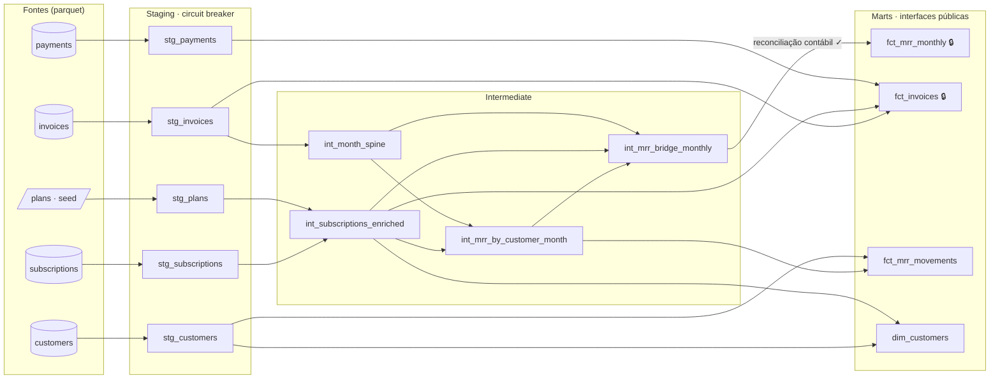

# FitCore MRR — Data Product com contratos e quality gates no dbt

**MBA FIAP · Data Product Management & Value Delivery · Trilha 2: Engenharia e Qualidade**
Grupo: _[nomes e RMs]_ · Entrega: 04/10/2026

> **Em uma frase:** um pipeline dbt (staging → intermediate → marts) que publica a ponte de MRR de uma empresa SaaS e **se recusa a publicar** quando o dado que chega está quebrado, seja no schema, no conteúdo ou na lógica contábil, mantendo o consumidor na última versão válida.

| Item do enunciado | Onde está | Evidência |
|---|---|---|
| **Mandatório:** pipeline Staging + Mart com Model Contract `enforced: true` | `fct_mrr_monthly` e `fct_invoices` | [`01_contract.log`](evidencias/01_contract.log) |
| **Bônus 1:** asserções estatísticas com dbt-expectations | 18 testes, 4 famílias + anomalia | [`05_anomaly.log`](evidencias/05_anomaly.log) |
| **Bônus 2:** teste singular de regra contábil / integridade cruzada | `tests/*.sql` (2 testes) | [`02_bridge.log`](evidencias/02_bridge.log), [`04_semantic.log`](evidencias/04_semantic.log) |
| **Bônus 3:** circuit breaker no DAG | 3 cenários de injeção | [`03_schema.log`](evidencias/03_schema.log), [`04_semantic.log`](evidencias/04_semantic.log) |

Tudo é reproduzível com **um comando**: `./scripts/run_demo.sh`.

---

## 1. Contexto do data product

A **FitCore** (empresa fictícia) é um SaaS B2B de gestão de academias. Ela cobra assinaturas das academias em três níveis (Starter, Pro, Enterprise), com ciclo mensal ou anual.

**Problema de negócio.** MRR (receita recorrente mensal) é o principal indicador da empresa: orienta metas comerciais, reporte à diretoria e conversas com investidores. Um MRR errado não gera erro visível; gera uma decisão errada. Por isso o produto precisa garantir que **nenhum número inválido chegue ao dashboard**, mesmo que isso signifique mostrar o número do dia anterior.

**Consumidores.** Diretoria (reporte mensal), time de Revenue Operations (análise de churn e expansão) e Financeiro (faturamento e inadimplência).

**Interfaces públicas (marts).**

| Mart | Granularidade | Uso | Contrato |
|---|---|---|---|
| `fct_mrr_monthly` | mês | ponte de MRR: abertura, novo, reativação, expansão, contração, churn, fechamento | **enforced** |
| `fct_invoices` | fatura | faturamento, descontos e pagamentos | **enforced** |
| `fct_mrr_movements` | academia × mês | auditoria da ponte até o cliente | — |
| `dim_customers` | academia | plano e MRR atuais | — |

**Posicionamento: núcleo, não borda.** Seguindo a matriz vista na Aula 02, o contrato **ODCS** governa o produto perante os consumidores (borda: semântica, SLAs, ownership), enquanto o **Model Contract do dbt** blinda as tabelas internamente (núcleo: tipos e constraints). Esta entrega implementa o núcleo. Um `datacontract.yaml` ODCS sobre `fct_mrr_monthly` seria a camada seguinte, e o dbt é o que materializa o que ele promete.

---

## 2. Arquitetura



🔒 = Model Contract enforced. O grafo completo, com descrições e linhagem, é gerado por `dbt docs generate && dbt docs serve`.

| Camada | Responsabilidade | Materialização |
|---|---|---|
| **Staging** | tipagem, limpeza, renomeação 1:1 com a fonte. **É aqui que os gates de dados atuam.** | view |
| **Intermediate** | regras de negócio: MRR normalizado, foto mensal por cliente, cálculo da ponte. **Gate contábil.** | table |
| **Marts** | interfaces de consumo com contrato | table |

**Stack:** dbt-core 1.12 · dbt-duckdb 1.11 · DuckDB · dbt-expectations (fork Metaplane, revisão 0.10.10). As fontes são parquet lidos diretamente pelo DuckDB, sem carga prévia.

---

## 3. Como reproduzir

**GitHub Codespaces (recomendado):** abrir o repositório em um Codespace. O `.devcontainer` instala as dependências e roda `dbt deps`. Depois:

```bash
./scripts/run_demo.sh            # todos os cenários (≈ 1 min)
./scripts/run_demo.sh clean      # só a linha de base
```

**Local:**

```bash
pip install -r requirements.txt
export DBT_PROFILES_DIR=$PWD/dbt_project
cd dbt_project && dbt deps && cd ..
./scripts/run_demo.sh
```

| Cenário | O que simula | Resultado esperado |
|---|---|---|
| `clean` | dados íntegros | 76/76 nós OK, marts publicados |
| `contract` | dev muda o tipo de uma coluna do mart | build recusado pelo contrato |
| `bridge` | dev inverte o sinal da contração | ponte não fecha, mart não republicado |
| `schema` | origem passa a enviar valor como texto | ramo de pagamentos bloqueado na fonte |
| `semantic` | faturas duplicadas e valores negativos | staging falha, intermediate e marts SKIPPED |
| `anomaly` | faturamento de um mês dobrado | alerta (warn), pipeline segue |

Os logs completos de cada cenário ficam em [`evidencias/`](evidencias/).

---

## 4. Mandatório: pipeline e Model Contract

### 4.1 Passo a passo da construção

1. **Dados de origem.** `scripts/generate_data.py` simula 45 meses de operação (779 academias, 955 assinaturas, 9.645 faturas, 9.535 pagamentos) com crescimento, sazonalidade de academias (pico em janeiro e março, vale em dezembro), churn, upgrades, downgrades, reativações e inadimplência. A semente é fixa e a data de corte é **ontem**, para que os testes estatísticos, cuja janela é relativa à data atual, sempre avaliem meses recentes.
2. **Catálogo de planos como seed** (`seeds/plans.csv`): 6 linhas estáticas, tipadas via `column_types`.
3. **Staging** (`models/staging/`): um modelo por fonte. Conversões usam `try_cast`, de modo que um valor fora do tipo vira nulo e é **barrado por um teste com diagnóstico**, em vez de derrubar o pipeline com erro de conversão genérico.
4. **Intermediate** (`models/intermediate/`): MRR por assinatura, calendário mensal, foto de MRR por academia e mês com classificação do movimento e cálculo da ponte.
5. **Marts** (`models/marts/`): interfaces públicas; as duas críticas com contrato.

### 4.2 Regra de MRR (premissa de negócio explícita)

- Plano mensal → preço de lista; plano anual → preço de lista ÷ 12. Em ambos, aplica-se o desconto negociado da assinatura.
- O MRR é medido na **foto do último dia do mês**: conta toda assinatura com `start_date ≤ fim do mês` e sem término até essa data.
- Movimento por academia, comparando com o mês anterior: **novo** (primeira vez com MRR), **reativação** (volta após churn), **expansão**, **contração** e **churn**.

### 4.3 Model Contract

```yaml
- name: fct_mrr_monthly
  config:
    contract:
      enforced: true
  columns:
    - name: month_start
      data_type: date
      constraints:
        - type: not_null
        - type: primary_key
    - name: closing_mrr
      data_type: decimal(14,2)
      constraints: [{type: not_null}]
    # ... 10 colunas, todas tipadas
```

O contrato é verificado **antes** de a tabela ser substituída: o dbt compara nomes e tipos que o SQL produz com os declarados e, se divergirem, recusa o build. As constraints `not_null` e `primary_key` são aplicadas na criação da tabela pelo DuckDB.

**Evidência ([`01_contract.log`](evidencias/01_contract.log)).** O cenário troca `active_customers` de `integer` para `varchar` no SQL do mart:

```
This model has an enforced contract that failed.
| column_name      | definition_type | contract_type | mismatch_reason    |
| active_customers | VARCHAR         | INTEGER       | data type mismatch |
Done. PASS=0 WARN=0 ERROR=1 SKIP=2
```

A impressão digital do mart antes e depois é idêntica (`hash=64336767892a`): o consumidor não percebeu a tentativa.

---

## 5. Pirâmide de testes

A estratégia segue a pirâmide de qualidade da Aula 02: base larga de testes baratos, poucos testes de regra de negócio e, no topo, testes estatísticos. São **62 testes** no total.

| Camada da pirâmide | Quantidade | Exemplos |
|---|---|---|
| **Base:** genéricos nativos | 42 | `unique`, `not_null`, `accepted_values`, `relationships` |
| **Meio:** regras singulares (Bônus 2) | 2 | ponte de MRR, pagamento ≤ fatura |
| **Topo:** dbt-expectations (Bônus 1) | 18 | faixas, regex, volumetria, schema, distribuição, anomalia |

O enunciado pede Staging + Mart como mínimo; a camada intermediate foi incluída porque é onde a arquitetura ensinada na Aula 02 coloca a lógica de negócio, e porque é ela que permite o gate contábil da seção 5.2.

### 5.1 Bônus 1: asserções estatísticas (dbt-expectations)

Um teste justificado por família de asserção, sem testes "por precaução":

| Família | Teste | Onde | Regra de negócio | Severidade |
|---|---|---|---|---|
| Forma e volume | `expect_table_columns_to_match_ordered_list` | fontes `invoices`, `payments` | coluna renomeada, removida ou adicionada na origem | error |
| Forma e volume | `expect_column_values_to_be_in_type_list` | fonte `payments.amount_paid` | valor chegando como texto | error |
| Forma e volume | `expect_table_row_count_to_be_between` | `stg_invoices` | lote vazio ou inflado por reprocessamento | error |
| Faixas e estatística | `expect_column_values_to_be_between` | `stg_invoices.amount` e outras | valor ≥ 0 e ≤ plano mais caro; desconto ≤ 30% | error |
| Faixas e estatística | `expect_column_mean_to_be_between` | `fct_invoices.net_to_list_ratio` | desconto médio da carteira coerente com a política comercial | warn |
| Texto e regex | `expect_column_values_to_match_regex` | `stg_customers.cnpj` | CNPJ no formato `00.000.000/0000-00` | error |
| Distribuição | `expect_column_values_to_be_in_set` | status de assinatura, fatura, meio de pagamento | valor fora do ciclo de vida | error |
| Multicoluna | `expect_column_pair_values_A_to_be_greater_than_B` | `stg_subscriptions` | assinatura encerrada termina depois de começar | error |
| **Anomalia** | `expect_column_values_to_be_within_n_moving_stdevs` | `fct_invoices.amount` | variação mensal do faturamento fora de 3σ da tendência dos 6 meses anteriores | **warn** |

**Decisão de desenho no teste de anomalia: `group_by: [billing_period]`.** A primeira versão media o faturamento total semanal e **não detectou** a anomalia injetada: faturas anuais (até R$ 9.709) entram em semanas irregulares e o ruído escondia o sinal. Separar as séries mensal e anual e medir por mês fechado resolveu. Ou seja, a escolha da granularidade e do agrupamento é parte do teste, não detalhe.

**Por que `warn` e não `error`, se a diretriz da aula é "erro em finanças"?** Porque a severidade deve seguir o **tipo de garantia**, não só o domínio:

- **Violações determinísticas** (chave nula, duplicata, valor negativo, ponte que não fecha, quebra de contrato) nunca são legítimas → `error`, bloqueia.
- **Desvios probabilísticos** (volume ou média fora do padrão) podem ser legítimos → `warn`, alerta para análise humana.

Medido nos dados íntegros, o teste de 3σ dispara em ~5% dos meses históricos, inclusive em **janeiro de 2025, pico sazonal real** de contratações. Bloquear o reporte de receita no mês em que ele mais importa seria um falso positivo caro.

**Evidência ([`05_anomaly.log`](evidencias/05_anomaly.log)).** 437 faturas mensais de agosto tiveram o valor dobrado. Cada uma continua dentro da faixa válida, então nenhuma regra linha a linha é violada:

```
WARN 1 dbt_expectations_expect_column_values_to_be_within_n_moving_stdevs_fct_invoices_amount...
Done. PASS=75 WARN=1 ERROR=0 SKIP=0
```

### 5.2 Bônus 2: regras contábeis singulares

**`tests/assert_mrr_bridge_reconciles.sql` — a ponte de MRR precisa fechar:**

```
abertura + novo + reativação + expansão − contração − churn = fechamento
abertura(mês) = fechamento(mês anterior)
```

Duas decisões tornam este teste significativo:

1. **Os dois lados são calculados de forma independente.** O fechamento vem direto da foto das assinaturas ativas no fim do mês; os movimentos vêm da comparação cliente a cliente. Se o fechamento fosse a soma dos movimentos, a ponte fecharia por construção e o teste seria **tautológico**.
2. **O teste roda na intermediate, não no mart.** No `dbt build`, testes de um modelo rodam antes dos seus filhos. Testando `int_mrr_bridge_monthly`, uma ponte que não fecha **impede a publicação** do `fct_mrr_monthly`. Testando o próprio mart, o erro seria detectado só depois de o consumidor já estar vendo o número errado.

**Evidência ([`02_bridge.log`](evidencias/02_bridge.log)).** Um desenvolvedor inverte o sinal da contração. Schema e tipos continuam corretos, então o contrato **não** pega; a regra contábil pega:

```
FAIL 21 assert_mrr_bridge_reconciles
SKIP relation marts.fct_mrr_monthly
| month_start | bridge_gap |
|  2026-09-01 |     -1,850 |
```

**`tests/assert_payments_do_not_exceed_invoice.sql` — integridade cruzada:** o total pago de uma fatura não pode exceder o faturado. Excesso indica pagamento duplicado ou vinculado à fatura errada. Roda sobre o staging (shift-left). Dispara no cenário `semantic` ([`04_semantic.log`](evidencias/04_semantic.log)): faturas duplicadas multiplicam o join com pagamentos.

Todos os testes usam `store_failures: true`: as linhas que violam cada regra ficam gravadas no schema `audit` do DuckDB, prontas para investigação.

---

## 6. Bônus 3: circuit breaker no DAG

Os gates estão posicionados para que **dado inválido nunca chegue a um mart**. Quando um teste com `severity: error` falha, o `dbt build` marca todo o downstream como `SKIPPED`, e o consumidor continua lendo a última versão válida.

A prova é a **impressão digital do consumidor** (`scripts/consumer_snapshot.py`): contagem, soma e hash do conteúdo de cada mart, antes e depois de cada injeção.

| Cenário | Corrupção injetada | Onde parou | Efeito no DAG | Mart antes → depois |
|---|---|---|---|---|
| `schema` | `amount_paid` chega como `"R$ 189,05"` | teste na **fonte** `payments` | `stg_payments` e `fct_invoices` SKIPPED; ramo de MRR segue | `fct_invoices` idêntico |
| `semantic` | 40 faturas duplicadas + 15 negativas | testes do **staging** | intermediate + `fct_mrr_monthly` + `fct_invoices` SKIPPED | ambos idênticos |
| `bridge` | sinal da contração invertido | teste contábil na **intermediate** | `fct_mrr_monthly` SKIPPED | idêntico |
| `contract` | tipo de coluna alterado no SQL | **contrato** do mart | build do mart recusado | idêntico |

Trecho de [`04_semantic.log`](evidencias/04_semantic.log):

```
--- Visão do consumidor (antes) ---
marts.fct_mrr_monthly    linhas=    45  soma(closing_mrr)=  4,143,468.10  hash=64336767892a
marts.fct_invoices       linhas= 9,645  soma(amount)=  4,523,416.20  hash=8ff5f7a5f89e
[semantic] 40 faturas duplicadas e 15 valores negativos injetados.
FAIL 15 dbt_expectations_expect_column_values_to_be_between_stg_fitcore__invoices_amount...
FAIL 40 unique_stg_fitcore__invoices_invoice_id
FAIL 54 assert_payments_do_not_exceed_invoice
SKIP relation intermediate.int_mrr_by_customer_month
SKIP relation marts.fct_invoices
SKIP relation marts.fct_mrr_monthly
--- Visão do consumidor (depois) ---
marts.fct_mrr_monthly    linhas=    45  soma(closing_mrr)=  4,143,468.10  hash=64336767892a
marts.fct_invoices       linhas= 9,645  soma(amount)=  4,523,416.20  hash=8ff5f7a5f89e
```

**Contenção do raio de impacto.** No cenário `schema`, o `fct_mrr_monthly` **continua sendo atualizado**, porque não depende de pagamentos. O circuit breaker abre só no ramo afetado; o resto do produto segue entregando valor. Um hard gate global ("qualquer erro para tudo") seria mais simples e pior.

**Hard gate vs. soft gate.** Faturamento e MRR são processos de "tudo ou nada": um reporte de receita parcialmente correto é pior que um reporte de ontem. Por isso as violações determinísticas usam hard gate (`error`). A alternativa de quarentena/DLQ, discutida em aula, faz sentido para fluxos em que é aceitável publicar a parte válida e reprocessar o resto depois, o que não é o caso do reporte financeiro.

---

## 7. Limitações e próximos passos

- **Testes no mart detectam, mas não protegem o próprio mart.** Os testes declarados nos marts (ex.: anomalia em `fct_invoices`) rodam depois da materialização. Para os gates críticos isso foi resolvido posicionando-os no staging e na intermediate. A evolução natural é o padrão **Write-Audit-Publish**: construir o mart numa área de auditoria e só então promovê-lo.
- **Alerta do soft gate.** Hoje o `warn` aparece no log do build. Em produção, um hook `on-run-end` publicaria os resultados (de `run_results.json` e do schema `audit`) num canal de Slack.
- **Contrato de borda.** O próximo passo é um `datacontract.yaml` (ODCS) sobre `fct_mrr_monthly`, com SLA de atualização e owner, validado pelo `datacontract-cli` contra o mesmo DuckDB.
- **Janela relativa à data atual.** O teste de anomalia avalia os 6 meses fechados mais recentes em relação a hoje. Por isso o gerador corta os dados em "ontem". Rodar com `--as-of` antigo deixa o teste sem meses para avaliar.
- **Dados sintéticos.** Valores, sazonalidade e taxas são simulados; nenhum dado real de empresa foi usado.

---

## 8. Estrutura do repositório

```
.
├── README.md                     # este documento
├── requirements.txt              # versões travadas
├── .devcontainer/                # ambiente GitHub Codespaces
├── scripts/
│   ├── generate_data.py          # dados sintéticos (semente fixa)
│   ├── inject_corruption.py      # cenários schema | semantic | anomaly
│   ├── consumer_snapshot.py      # impressão digital dos marts
│   └── run_demo.sh               # demonstração ponta a ponta
├── dbt_project/
│   ├── dbt_project.yml           # camadas, schemas, store_failures
│   ├── packages.yml              # dbt-expectations (Metaplane, 0.10.10)
│   ├── profiles.yml              # DuckDB local
│   ├── seeds/plans.csv           # catálogo de planos
│   ├── models/staging/           # 5 modelos + _sources.yml + _staging.yml
│   ├── models/intermediate/      # 4 modelos + _intermediate.yml
│   ├── models/marts/             # 4 modelos + _marts.yml (contratos)
│   ├── macros/                   # nome de schema sem prefixo
│   └── tests/                    # 2 testes singulares
└── evidencias/                   # logs de cada cenário
```
